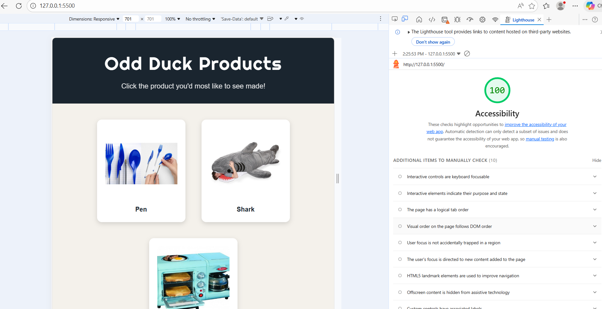

# Odd Duck Products 🦆

## Description
A voting app built for Odd Duck Product Co. Employees view 3 random product images at a time and vote for their favorite. After 25 rounds of voting, a results report displays total votes, times seen, and vote percentage for every product displayed in bar and doughnut charts.

## How To Use
1. Three product images will appear on screen
2. Click the product you would most like to see made
3. After 25 rounds the voting session ends automatically
4. Click **View Results** to see the full voting report with charts

## Features
- 19 unique product images displayed randomly
- No product repeats within 4 consecutive rounds (12 image memory window)
- Tracks votes and views per product
- Bar chart showing likes and views per product
- Doughnut chart showing vote share proportion
- Results hidden until all voting rounds are complete
- Full accessibility support

## Technologies Used
- HTML5
- CSS3
- JavaScript (ES5)
- Chart.js (v3.7.0)

## Lighthouse Accessibility Score

## Author
Raymond Alvarez